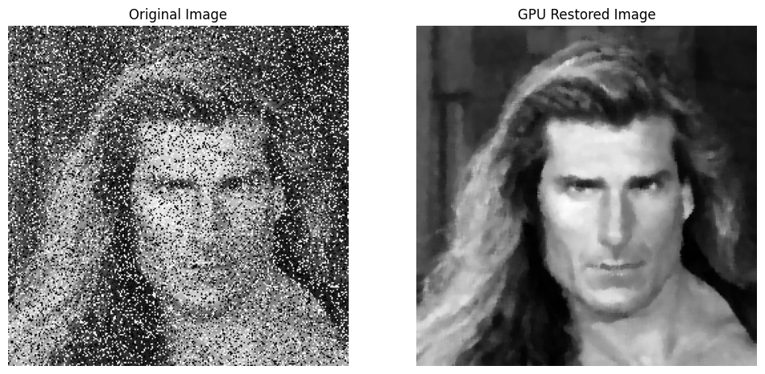

# GPU vs CPU Runtime Analysis



## Overview

This repository contains a project that compares the performance of image
processing operations when executed on a GPU vs. a CPU. The focus is on
analyzing the execution time for median filtering across a set of images,
providing insights into the efficiency gains achievable with GPU acceleration.

## Project Description

The project uses Python, with OpenCV for CPU-based image processing and Numba
for GPU acceleration. The primary goal is to measure and compare the execution
time for median filtering—an image denoising technique—on both the CPU and GPU.

## Key Features

- Image Processing: Applies median filtering to a set of images using both CPU and GPU.
- Runtime Comparison: Measures and logs the execution time for both methods.
- Visualization: Displays original and processed images side by side for visual comparison.

## Getting Started

### Prerequisites

- Python 3.x
- Libraries: OpenCV, Numba, Matplotlib, NumPy
- CUDA-enabled GPU for running GPU-accelerated code

### Installation

Clone this repository or download the source code.  
Install required Python packages:

```bash
pip install opencv-python numba matplotlib numpy
```

### Usage

Place your images in the image-data directory.  
Run the Jupyter Notebook.  
The notebook will process the images and display the results along with the
runtimes.
